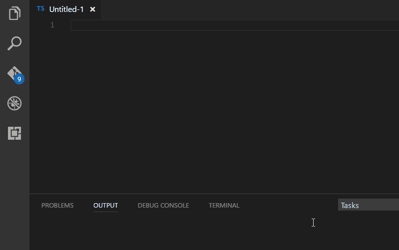

# Vue/Vuex TypeScript Snippets for VS Code

This extension for Visual Studio Code adds snippets for Vue/Vuex for TypeScript and HTML.



## Usage
Type part of a snippet, press `enter`, and the snippet unfolds.

### TypeScript Snippets
```typescript
v-bootstrap       // Vue bootstrapping, for main.ts
v-component       // Vue component
v-component-http  // Vue component containing http get with Axios
v-component-test  // Vue sample component test with Mocha
v-test-helper     // Vue component test helper
v-routing         // Vue routing
v-service         // Service class
v-store           // Vuex store using vuex-typescript - https://www.npmjs.com/package/vuex-typescript
v-component-store // Vue component using Vuex store from v-store snippet
```

### HTML Snippets
```html
v-class
v-for
v-if
v-else-if
v-href
v-show
v-model
v-submit
v-click
v-routerView
v-routerLink
```

Alternatively, press `Ctrl`+`Space` (Windows, Linux) or `Cmd`+`Space` (OSX) to activate snippets from within the editor.

## Installation

1. Install Visual Studio Code
2. Launch Code
3. From the command palette `Ctrl`-`Shift`-`P` (Windows, Linux) or `Cmd`-`Shift`-`P` (OSX)
4. Select `Install Extension`
5. Choose the extension
6. Reload Visual Studio Code
